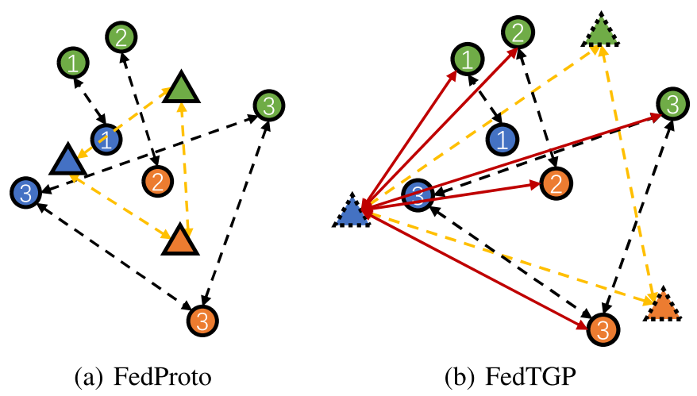

# Introduction

This is the implementation of our paper *[FedTGP: Trainable Global Prototypes with Adaptive-Margin-Enhanced Contrastive Learning for Data and Model Heterogeneity in Federated Learning](https://arxiv.org/abs/2401.03230)* (accepted by AAAI 2024). 

*Key words: federated learning, data heterogeneity, model heterogeneity, communication overhead, intellectual property (IP) protection*

Take away: We enhance the typical HtFL method FedProto with Trainable Global Prototypes (TGP) and Adaptive-margin-enhanced Contrastive Learning (ACL), making it more versatile and resilient to various model heterogeneities. 

- [Slides](./[AAAI]%20FedTGP.pdf)
- [Poster](./FedTGPPoster.pdf)

The global and client prototypes in FedProto and our FedTGP. Different colors and numbers represent classes and clients, respectively. Circles represent the client prototypes and triangles represent the global prototypes. The black and yellow dotted arrows show the inter-class separation among the client and global prototypes, respectively. Triangles with dotted borders represent our Trainable Global Prototypes (TGP). The red arrows show the inter-class intervals between TGP and the client prototypes of other classes in our Adaptive-margin-enhanced Contrastive Learning (ACL).

# Dataset

Due to the file size limitation of the supplementary material, we only upload the statistics (`config.json`) of the Cifar10 dataset in the practical setting ($\beta=0.1$). Please refer to the popular repository [PFLlib](https://github.com/TsingZ0/PFLlib) to generate all the datasets and create the required python environment. 

# System

- `main.py`: system configurations. 
- `run_me.sh`: command lines to run experiments. 
- `flcore/`: 
    - `clients/`: the code on clients. See [HtFL](https://github.com/TsingZ0/HtFL) for baselines.
    - `servers/`: the code on servers. See [HtFL](https://github.com/TsingZ0/HtFL) for baselines.
    - `trainmodel/`: the code for models. 
- `utils/`:
    - `data_utils.py`: the code to read the dataset. 
    - `mem_utils.py`: the code to record memory usage. 
    - `result_utils.py`: the code to save results to files. 